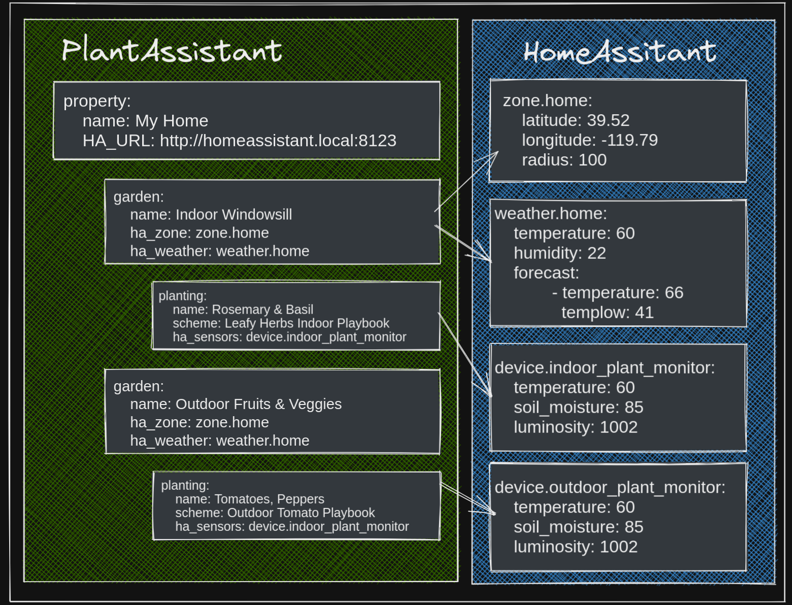

# Plant Assistant

Open source plant care assistant software; integrates with [Home Assistant](https://www.home-assistant.io/)
to read plant sensor data and manage plant lifecycle events.

## Current Status - WIP, Unstable

Not advised for use by anyone yet. This is a work in progress.

### Integration Diagram

### Roadmap

v0.1 Alpha - Headless MVP:

- [x] Backend Setup - [FastAPI](https://fastapi.tiangolo.com), [TortoiseORM](https://tortoise.github.io),
  [Celery](https://docs.celeryq.dev/), [strawberry-graphql](https://strawberry.rocks/)
  , [uvicorn](https://www.uvicorn.org/)
- [x] Database Setup - [PostgreSQL](https://www.postgresql.org/) or [SQLite](https://www.sqlite.org/index.html)
- [x] Docker containers - Backend, Database, Redis, Celery worker, Celery beat, Home Assistant
- [x] Simple Authentication and Authorization - [FastAPI-jwt-auth](https://indominusbyte.github.io/fastapi-jwt-auth/)
- [x] Connect to Home Assistant REST API via LongLivedToken
- [x] Property Model - a Property is a location connected to a Home Assistant
- [x] Garden Model - Home Assistant zones used to group plants
- [x] Plantings Model - Plantings are a group of plants in a Zone that share the same recipe
- [ ] *WIP* Scheme Model - Schemes are recipes or instructions for growing (and monitoring) a planting
- [ ] Onboarding API - Create first Property with HA URL and auth token
- [ ] Garden API - Import Zones from Home Assistant
- [ ] Planting API - CRUD mutations for Plantings
- [ ] Planting Health Monitor - check Zone Sensor Data compared to Recipe parameters, and set Planting.health
- [ ] HA Zone Health - Summarize plantings in a Zone, and set Zone.plant_health in HA
- [ ] Advanced Test Cases - Test cases covering many recipe and planting scenarios under different weather simulations

v0.2 Beta - Usable Demo With Frontend:

- [ ] Frontend UI - Onboarding, Property, Zone, Recipe, Planting CRUD
- [ ] Frontend UI - Manage Users, Invite Collaborators
- [ ] Forecasts integration - Use HA forecast data to provide predictive alerts

Wishlist - Nice To Have - Low Priority:

- [ ] HA Plant Entities - Create (optional) Plant entities in HA and update with health data
- [ ] HA/PA Cards - Lovelace cards for HA that show off PA data (Zone overview, Plant inspector, etc)
- [ ] Multi-channel notifications - email, SMS, push, etc.
- [ ] Labor scheduling, duty rota, calendar integrations

## Disclaimer

Plant Assistant is built by BoundCorp and not associated with Home Assistant or Nobu Casa in any way.
It is a separate project that uses the Home Assistant API, and aims to be a useful companion to Home Assistant.